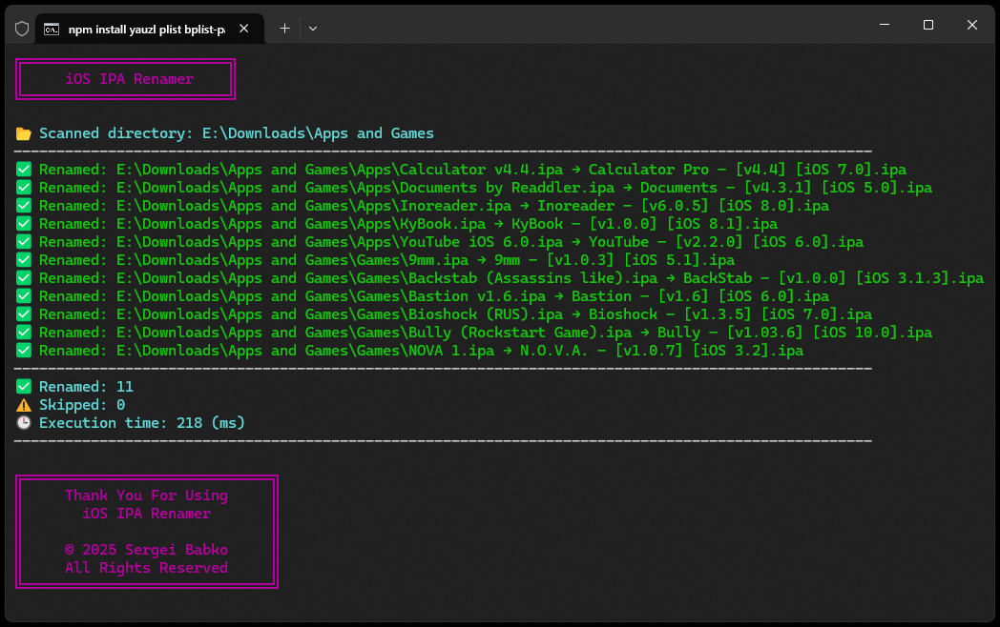

# 🗂 iOS IPA Renamer | [EN](https://github.com/SergeiBabko/iOSIPARenamer/blob/main/README.md)

<p align="center">
  
</p>

**iOSIPARenamer** — это удобный инструмент на Node.js, который помогает навести порядок в вашей коллекции .ipa-файлов: он сам находит приложения, считывает информацию о них и переименовывает файлы в красивый и понятный формат.

---

## 🔧 Возможности

* Рекурсивно сканирует все `.ipa`-файлы в текущей папке и подпапках
* Распаковывает и парсит `Info.plist` (в бинарном или XML-формате), чтобы извлечь:

  * Отображаемое имя приложения или название бандла (например, `Angry Birds`)
  * Краткую версию приложения (например, `v1.2.3`)
  * Минимальную поддерживаемую версию iOS (например, `iOS 10.0`)
* Переименовывает файлы в формат:

  * `ИсходноеИмя ↔ Название – [v1.2.3] [iOS 10.0].ipa`
  * Если `INCLUDE_ORIGINAL_NAME = false`, исходное имя не добавляется
* Пропускает неподдерживаемые или некорректные IPA-файлы
* При включённой опции `SAVE_LOGS` сохраняет лог в файл (`#IPArenamerLogs.txt`)
* Показывает результаты на русском или английском языке в зависимости от настроек системы
* Выводит краткое резюме со временем выполнения и количеством обработанных файлов
* После завершения очищает временные и установочные файлы

---

## 🚀 Как использовать

1. Установите [Node.js](https://nodejs.org)

2. Поместите скрипт в папку с вашими IPA-файлами

3. Запустите одним из следующих способов:

* Дважды кликните `#iOSIPARenamer.bat`
* Или выполните в терминале:

  ```bash
  npm install adm-zip plist bplist-parser
  node "#iOSIPARenamer.js"
  ```

4. Готово! Ваши IPA-файлы будут переименованы на основе их метаданных.

---

## 📦 Поддерживаемые типы файлов

Скрипт обрабатывает только `.ipa`-приложения. Все другие расширения будут проигнорированы.

---

## 📁 Пример результата

```txt
📂 Apps and Games
├── Angry Birds SW ↔ Angry Birds Star Wars – [v1.2.0] [iOS 6.0].ipa
├── Townsmen v1144 ↔ Townsmen Premium – [v1.14.4] [iOS 10.0].ipa
└── YT v2.0.1 ↔ YouTube – [v2.0.1] [iOS 5.1].ipa
```

---

## ℹ️ Примечания

* Файлы без корректного `Info.plist` будут пропущены
* Содержимое IPA-файлов никогда не изменяется
* Автоматическая очистка удаляет следующие файлы и папки:

  * `node_modules`
  * `package.json`
  * `package-lock.json`

---

## 📊 После завершения

* Показывает количество перемещённых, пропущенных и удалённых файлов
* Отображает общее время выполнения в понятной форме
* Резюме и системные сообщения выводятся на языке вашей системы
* Ошибки (например, сбои при перемещении) выделяются цветом
